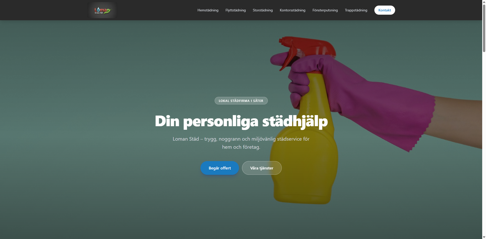
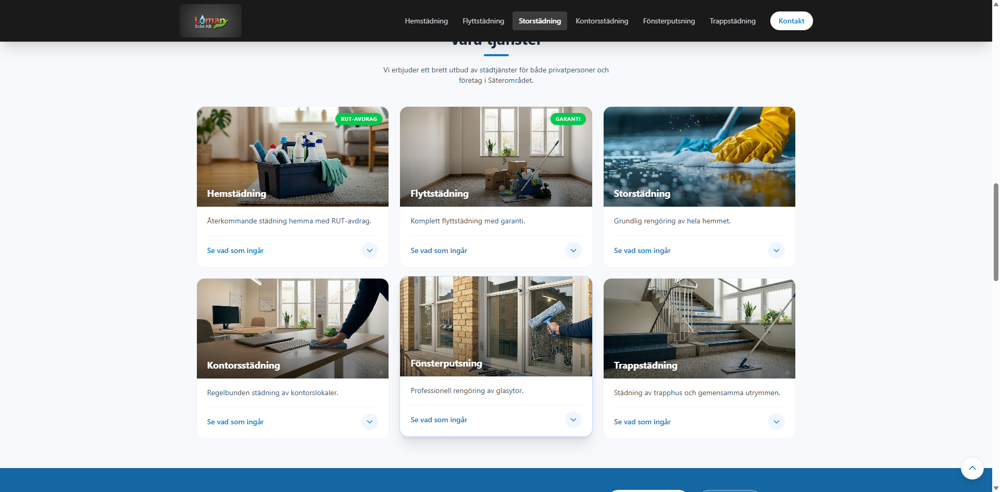
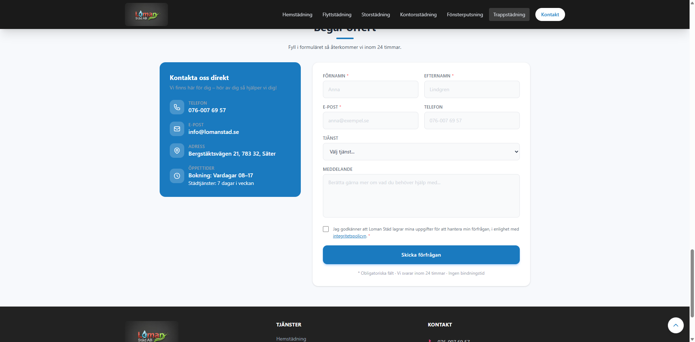

# Loman Städ – Website

A professional cleaning company website built for **Loman Städ**, a Swedish cleaning service offering hemstädning, flyttstädning, storstädning, kontorsstädning, fönsterputsning, and trappstädning.

## Screenshots

### Hero


### Services


### Contact Form


## Tech Stack

- **React 19** – UI
- **Vite 8** – Build tool
- **Tailwind CSS v4** – Styling
- **EmailJS** – Contact form email delivery
- **Sanity** – Headless CMS (studio in `/studio`)

## Features

- Fully responsive (mobile & desktop)
- Smooth scroll navigation with active link highlighting
- Service cards with expandable details (accordion)
- Quote request form with validation and EmailJS integration
- Cookie consent banner
- GDPR privacy modal
- Nöjd-Kund-Garanti section
- Accessible (ARIA labels, focus rings, semantic HTML)

## Getting Started

```bash
npm install
npm run dev
```

## Build

```bash
npm run build
npm run preview
```

## CMS (Sanity Studio)

```bash
cd studio
npm install
npm run dev
```

Studio runs at `http://localhost:3333`

## Built By

[Abenezer Anglo](https://abasheger.github.io/)
